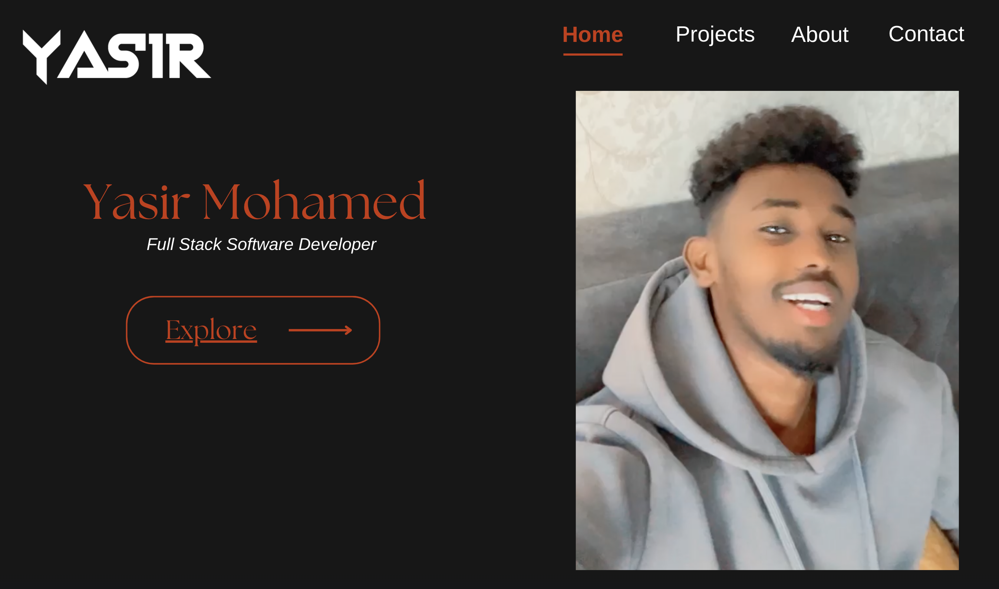
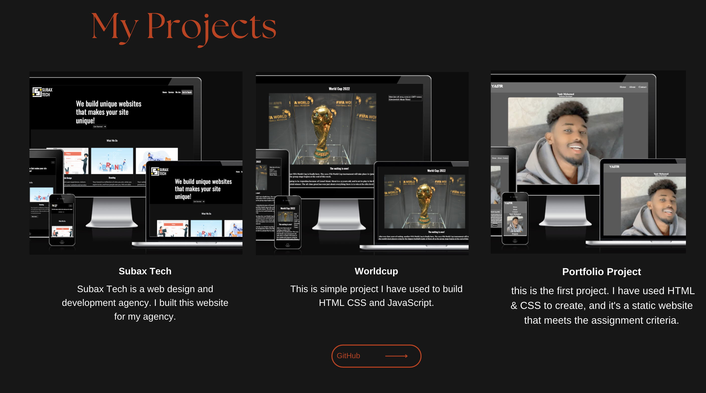
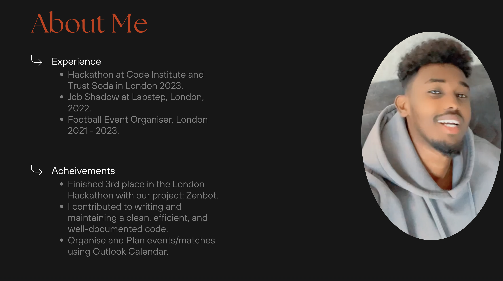
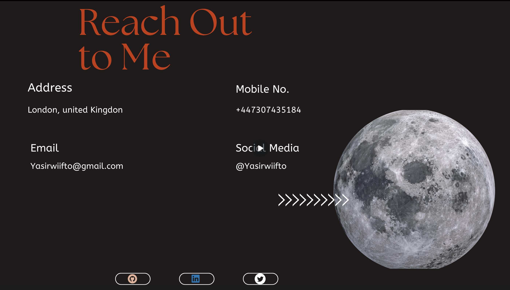
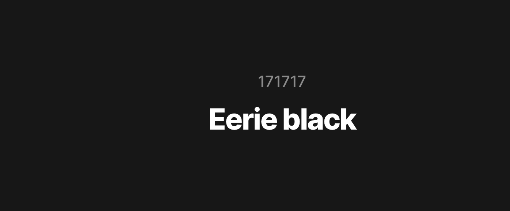
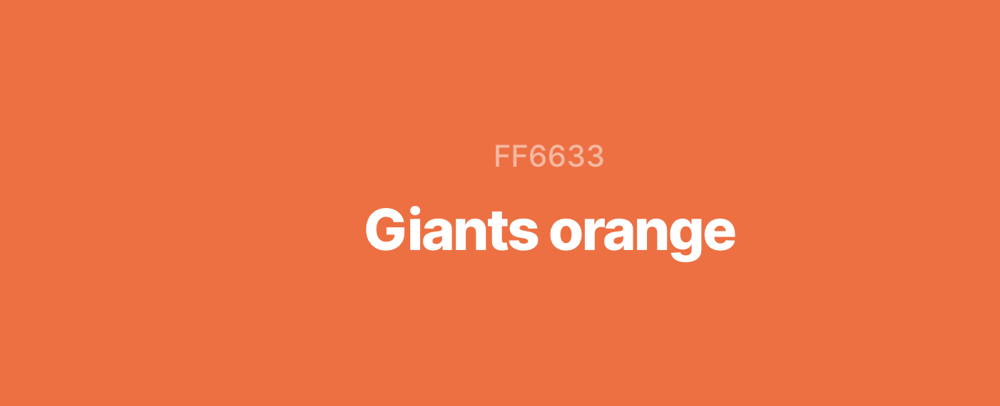
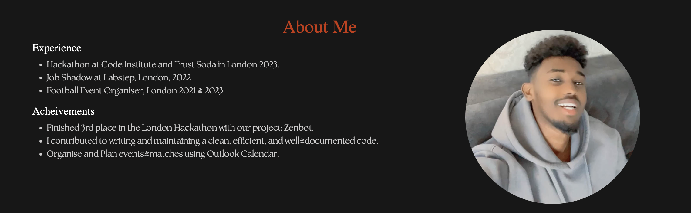
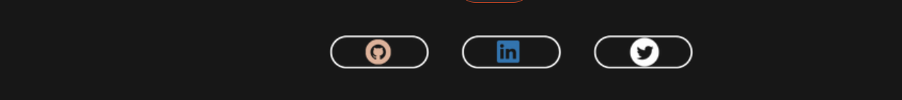

# My Second Portfolio Project

I am creating this portfolio as part of a series of projects. This is the second project that I have created using HTML, CSS, and JavaScript. It is a dynamic website that satisfies the assignment criteria.

<a href="https://yasirwiifto.github.io/My-Second-Portfolio/index.html">Website Link</a>

## Project Goals

 My web developer portfolio is primarily targeted at potential employers, effectively showcasing my experience and Achievements.

### **Target Audiences:**

* Recruiters: I am aware that recruiters often search for web developers through online portfolios. By optimizing my portfolio with relevant keywords and tags, I can increase its visibility to recruiters. This will make it easier for them to discover me and consider me as a candidate for various job opportunities.

* Personal and Professional Network: My portfolio serves as a means to keep my personal and professional network informed about my career progress. It also allows me to share my passion and accomplishments in web development. Friends, family, and colleagues who are interested in my work can easily access it.

* Students: By sharing my work and knowledge in my portfolio, I can foster valuable collaborations, network with industry professionals, and engage in knowledge exchange within the web development community.

***

### **User Stories:**

* As a visitor, I want to easily understand who the developer is, so I can quickly learn about their background and expertise.

* As a potential employer, I want to see the developer's experience and Achievements.

* As a visitor, I want to explore a portfolio section with project details and links to GitHub repositories, so I can assess the developer's practical skills and project diversity. 

***

### **Site Aims:**

* Use my portfolio to establish a strong online presence on professional platforms. This will increase the reach and impact of my portfolio.

* Prioritize providing a positive user experience and to focus on optimizing mobile responsiveness, ensuring fast loading times, and facilitating easy navigation.

***

## Design:

### Home Section

***

### Project Section

***

### About Section

***

### Contact Section

***

### Color Scheme 

* I have used #171717 for the background color.

* I have used #ff6633 for the title, the hovers and buttons.

### Typography

    I used two fonts for this project:

* The Seasons for the heading.

* Serif for the content.

## Features 

My website has one index page that contains four sections. Home Section, Projects Section,About Section, and Contact Section. It's designed to be responsive to various screen sizes.

### Header:
 - logo and navbar.

***

### Home Section:

Home section displays the site title, image and three project display slides.

***

### Project Section:

Project section displays the project that I have developed.

***

### About Section:

Displays my Experience and achievements.

***

### Contact Section:

Displays form that contains header, three label with two inputs and textarea and submit button.

***

### Footer:

The footer contains three social links each link opens external link.

***

## **Technologies**

* HTML
* CSS
* Bootstrap

***

### Libraries and frameworks

* Git - for version control.
* Bootstrap
* Gsap - JS
* GitHub - to store the project's code after being pushed from Git.
* Visual Studio Code - to code my project.
* Lighthouse - to test the accessibility of the website.
* Am I responsive? To present the website image on a different devices.
* Google Dev Tools - to test features, and responsiveness and to troubleshoot.
* Figma - to design of the project.
* Favicon.io - to generate favicon icons for the website.
* chat.openai - to write README file for the document.
* cooler - to check color contrast and the background and text color.

*** 

## Deployment

Github Pages was used to deploy the live website. The instructions to achieve this are below:

*  Log in (or sign up) to Github.

* Find the repository for this project, My-portfolio-one.

* Go to the Settings.

* Click on the Pages link in the left hand side navigation bar.

* Go to the Branch section, choose main from the drop down. 

*  Click Save. 

* Wait a few minutes then refresh the page.

* You will see:- Your live Github Pages site is now deployed at the URL shown.

***