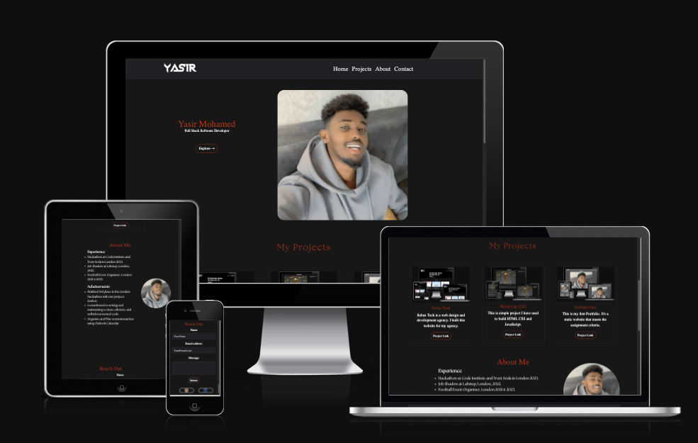

# My Second Portfolio Project

I am creating this portfolio as part of a series of projects. This is the second project that I have created using HTML, CSS, and JavaScript. It is a dynamic website that satisfies the assignment criteria.

<a href="https://yasirwiifto.github.io/My-Second-Portfolio/index.html">Website Link</a>

## Project Goals

 My web developer portfolio is primarily targeted at potential employers, effectively showcasing my experience and Achievements.

### **Target Audiences:**

* Recruiters: I am aware that recruiters often search for web developers through online portfolios. By optimizing my portfolio with relevant keywords and tags, I can increase its visibility to recruiters. This will make it easier for them to discover me and consider me as a candidate for various job opportunities.

* Personal and Professional Network: My portfolio serves as a means to keep my personal and professional network informed about my career progress. It also allows me to share my passion and accomplishments in web development. Friends, family, and colleagues who are interested in my work can easily access it.

* Students: By sharing my work and knowledge in my portfolio, I can foster valuable collaborations, network with industry professionals, and engage in knowledge exchange within the web development community.

***

### **User Stories:**

* As a visitor, I want to easily understand who the developer is, so I can quickly learn about their background and expertise.

* As a potential employer, I want to see the developer's experience and Achievements.

* As a visitor, I want to explore a portfolio section with project details and links to GitHub repositories, so I can assess the developer's practical skills and project diversity. 

***

### **Site Aims:**

* Use my portfolio to establish a strong online presence on professional platforms. This will increase the reach and impact of my portfolio.

* Prioritize providing a positive user experience and to focus on optimizing mobile responsiveness, ensuring fast loading times, and facilitating easy navigation.

***